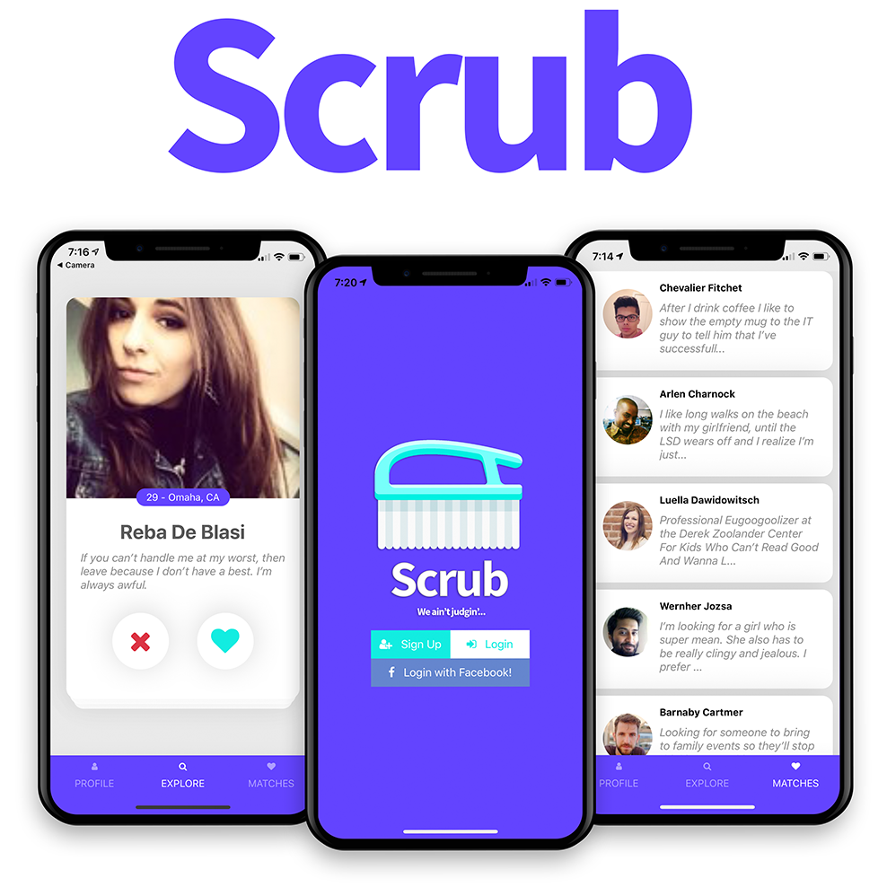

# Scrub



**Scrub:**

&nbsp;&nbsp;&nbsp;&nbsp;_**(verb)**_

&nbsp;&nbsp;&nbsp;&nbsp;_1. To rub hard so as to clean them, typically with a brush and water._

&nbsp;&nbsp;&nbsp;&nbsp;_**(adjective)**_

&nbsp;&nbsp;&nbsp;&nbsp;_1. [A scrub is a guy (or girl) that thinks he's fly and is also known as a busta.](https://genius.com/Tlc-no-scrubs-lyrics)_

## Getting Started

These instructions will get you a copy of the project up and running on your local machine for development and testing purposes. See deployment for notes on how to deploy the project on a live system.

### Prerequisites

1. Install Expo CLI
```
npm install expo-cli --global
```
2. Install Yarn
```
brew install yarn
```

3. Create a new database via [Firebase](https://firebase.google.com/)

4. Create a new [Facebook application](https://developers.facebook.com/apps) (used for user authentication)

5. Set up [AWS S3](https://aws.amazon.com/s3/) service for image storage

### Installing

1. Install dependencies

via `yarn`:
```
yarn
```

via `npm`:
```
npm install
```

2. Create .env file with the following environment variables

**Firebase**

* FIREBASE_API_KEY
* FIREBASE_AUTH_DOMAIN
* FIREBASE_DB_URL
* FIREBASE_PROJECT_ID
* FIREBASE_STORAGE_BUCKET
* FIREBASE_SENDER_ID
* FIREBASE_APP_ID

**Facebook**

FB_KEY

**AWS**

AWS_ACCESS_KEY
AWS_SECRET_KEY
GOOGLE_API_KEY

2. Start Expo
```
expo start
```

## Built With

* [React Native](https://facebook.github.io/react-native/)
* [Expo](https://expo.io/)
* [Firebase](https://firebase.google.com/) 

## License

This project is licensed under the MIT License - see the [LICENSE.md](LICENSE.md) file for details
